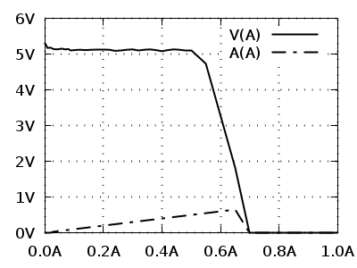

## usage

Any number of commands dan be given to load. Commands will be executed in order.

```
./load comand [command [command [command] [...]]]
```


## commands

* on - enables loads
* off - disables load
* start - starts printing status into uart (internal thing, needs to be enabled once)
* stop - stops printing status into uart (may prevent this project from working if used)
* slp - sleeps for some time (for example to wait for the current to stabilize before taking measurement)

* data - prints one status data line in loads native format
* settings - prints load settings in loads native format

* getVolts - prints voltage e.g. 5.23
* getAmps - prints current e.g. 0.50 
* getWatts - prints power e.g. 34.95
* getAmpHours - prints capacity in Ah e.g. 0.002
* getTime - prints operation time in HH:mm format

* getCsvVoltsAmps - prints volts and amps
* getCsvRow - print comma separated values of set_current, measured_current, voltage and power


## examples

```
./load off slp getCsvRow 3.14A on slp getCsvRow off
```

In this example 

* `off` - load wil be switched off (in case its not of already).
* `slp` - sleep for few seconds so that its really off
* `getCsvRow` - prints csv record with no load applied to record open voltage
* `3.14A` - sets load current
* `on` - switches on the load
* `slp` - waits for current to stabilize
* `getCsvRow` - prints another csv line with data under load
* `off` - switches load off for good measure.


## examlpe test with graph

```
./sample_tests/full_range_test.sh > test.csv \
&& ./sample_plots/single_voltage_current_400x300.gnuuplot "title of the test" > test.png
```

Output from previous example also can be saved to csv file and used to plot the graph.

</img>
